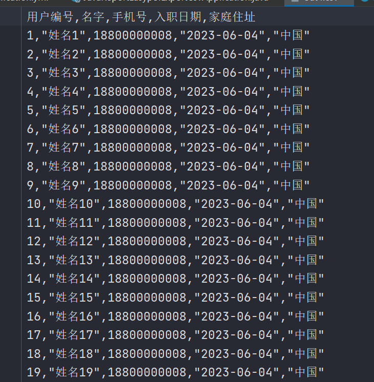
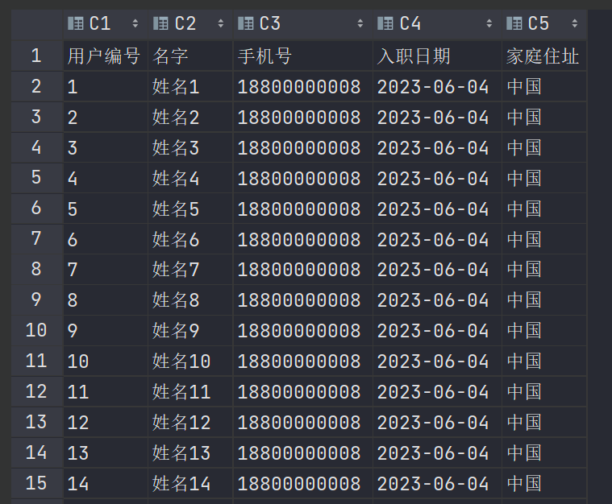

# easyPOI

## 导出CSV

csv的导出基本上和excel的导出一致，大体参数也是一致的

CsvExportParams 的参数描述如下：

|    属性    |   类型   | 默认值 |               功能               |
| :--------: | :------: | :----: | :------------------------------: |
|  encoding  |  String  |  UTF8  |             文件编码             |
| spiltMark  |  String  |   ,    |              分隔符              |
|  textMark  |  String  |   “    | 字符串识别,可以去掉,需要前后一致 |
| titleRows  |   int    |   0    |           表格头,忽略            |
|  headRows  |   int    |   1    |               标题               |
| exclusions | String[] |   0    |            忽略的字段            |


```java
package mao.java_report_easypoi_export_csv.service;

import com.baomidou.mybatisplus.extension.service.IService;
import mao.java_report_easypoi_export_csv.entity.User;

/**
 * Project name(项目名称)：java_report_easypoi_export_csv
 * Package(包名): mao.java_report_easypoi_export_csv.service
 * Interface(接口名): UserService
 * Author(作者）: mao
 * Author QQ：1296193245
 * GitHub：https://github.com/maomao124/
 * Date(创建日期)： 2023/6/7
 * Time(创建时间)： 14:32
 * Version(版本): 1.0
 * Description(描述)： 无
 */

public interface UserService extends IService<User>
{
    /**
     * 下载csv
     */
    void downloadCSV();
}
```


```java
package mao.java_report_easypoi_export_csv.service.impl;

import cn.afterturn.easypoi.csv.CsvExportUtil;
import cn.afterturn.easypoi.csv.entity.CsvExportParams;
import com.baomidou.mybatisplus.extension.plugins.pagination.Page;
import com.baomidou.mybatisplus.extension.service.impl.ServiceImpl;
import lombok.extern.slf4j.Slf4j;
import mao.java_report_easypoi_export_csv.entity.User;
import mao.java_report_easypoi_export_csv.mapper.UserMapper;
import mao.java_report_easypoi_export_csv.service.UserService;
import org.springframework.stereotype.Service;

import java.io.FileOutputStream;
import java.util.List;

/**
 * Project name(项目名称)：java_report_easypoi_export_csv
 * Package(包名): mao.java_report_easypoi_export_csv.service.impl
 * Class(类名): UserServiceImpl
 * Author(作者）: mao
 * Author QQ：1296193245
 * GitHub：https://github.com/maomao124/
 * Date(创建日期)： 2023/6/7
 * Time(创建时间)： 14:32
 * Version(版本): 1.0
 * Description(描述)： 无
 */

@Slf4j
@Service
public class UserServiceImpl extends ServiceImpl<UserMapper, User> implements UserService
{

    @Override
    public void downloadCSV()
    {
        log.info("开始导出csv文件");
        try (FileOutputStream fileOutputStream = new FileOutputStream("./out4.csv"))
        {
            //查询
            List<User> userList = this.page(new Page<>(0, 10000)).getRecords();
            CsvExportParams params = new CsvExportParams();
            params.setEncoding(CsvExportParams.UTF8);
            //表头
            //params.setExclusions(new String[]{"编号", "姓名", "手机号", "入职日期", "地址"});
            CsvExportUtil.exportCsv(params, User.class, userList, fileOutputStream);
            log.info("csv文件导出完成");
        }
        catch (Exception e)
        {
            e.printStackTrace();
        }
    }
}
```


```java
package mao.java_report_easypoi_export_csv;

import mao.java_report_easypoi_export_csv.service.UserService;
import org.springframework.boot.SpringApplication;
import org.springframework.boot.autoconfigure.SpringBootApplication;
import org.springframework.context.ConfigurableApplicationContext;

@SpringBootApplication
public class JavaReportEasypoiExportCsvApplication
{

    public static void main(String[] args)
    {
        ConfigurableApplicationContext applicationContext =
                SpringApplication.run(JavaReportEasypoiExportCsvApplication.class, args);
        UserService userService = applicationContext.getBean(UserService.class);
        userService.downloadCSV();
    }

}
```


效果：







如果需要导出几百万数据时不可能全部加载到一个List中的，所以easyPOI的方式导出csv是支持不了太大的数据量的，如果导出几百万条数据还是得选择OpenCSV方式导出


